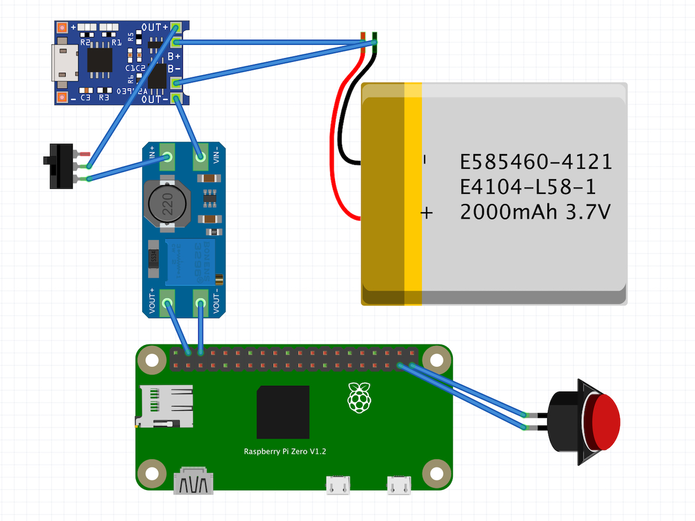
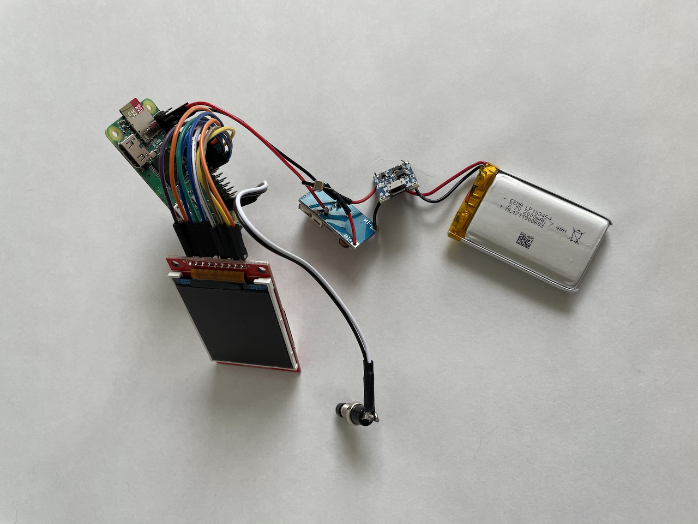

# RUHAcam 

A 3D Printable Retro-style Raspberry Pi HQ Camera

## Limited NFT Offer - For Good Cause! 

Visit [CaptureClub](https://captureclub.cc/drop-ruhacam) to collect limited RUHAcam NFT, 100% off at first purchase with promotion code `v5NbtC`.

We will donate raised money to [Program the World](https://programtheworld.tw/main.php) Association, [learn more](https://medium.com/numbers-protocol).

## Bill of Materials 

- Raspberry Pi Zero WH + microSD card 
- Raspberry Pi HQ Camera 
- 16mm 10MP Telephoto Lens 
- 2.2" TFT Display 
- TP4056 Micro USB Battery Charger 
- MT3608 DC-DC Step Up Boost Module 
- 2000mAh Lipo battery 
- Power switch 
- Shutter button 
- Dupont jumper wires 
- 3D printed case (see [STL](STL) folder)
- Leather patches for couch (optional)

## Schematic

- Power from converter connects to Pi's `5V` (pin 4) and `GND` (pin 6)
- Shutter button connects to `GPIO26` (pin 37) and `GND` (pin 39) 

|  |  |
|-----|-----|

| Raspberry Pi pins | TFT display |
|-------------------|-------------|
| 3v3 (pin 17) | VCC |
| GND (pin 20) | GND |
| GPIO8 (pin 24) | CS |
| GPIO23 (pin 16) | RESET |
| GPIO24 (pin 18) | DC |
| GPIO10 (pin 19) | MOSI |
| GPIO11 (pin 23) | SCK | 
| GPIO18 (pin 12) | LED | 
| GPIO9 (pin 21) | MISO | 

## Assembly

|  |  |
|-----------------------|-----------------------|
|  |  |

## Software 

Flash Raspberry Pi OS to micro SD card. Then add following lines into `config.txt`: 

    gpu_mem=256
    dtoverlay=rpi-display
    display_rotate=2

For application, simply execute this script after boot: 

    from gpiozero import Button
    from picamera import PiCamera
    import time

    button = Button(26)

    with PiCamera() as camera:
        camera.resolution = (4056, 3040)
        camera.framerate = 5
        frame = int(time.time())
        camera.start_preview()
        while True:
            button.wait_for_press()
            camera.capture('/home/pi/Pictures/%03d.jpg' % frame)
            frame += 1

## Sample Pictures 

|  |  |
|----------------------------|----------------------------|
|  |  |

## Copyright and License

Copyright (c) 2021 Ruha Cheng & Penk Chen. All rights reserved. 

All files are licensed under MIT license, see the LICENSE for more information. 
